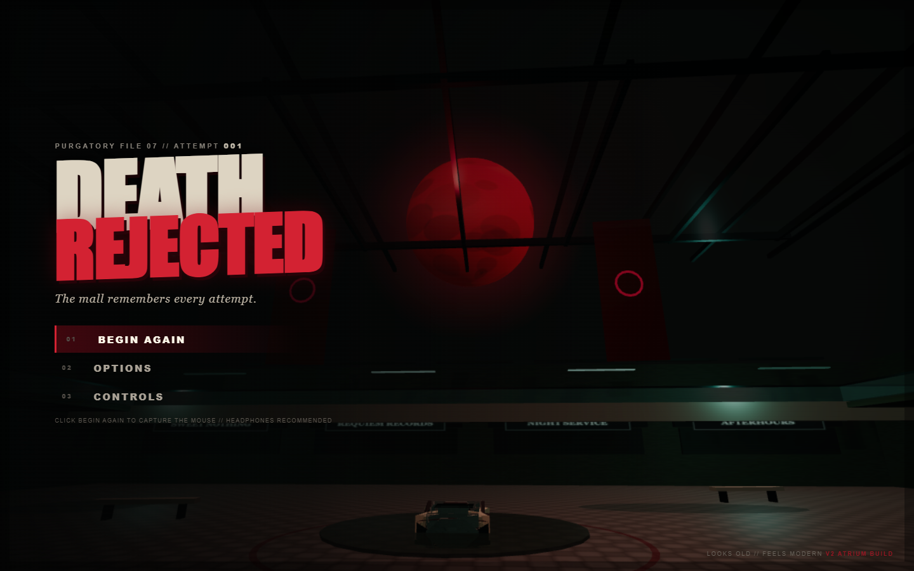
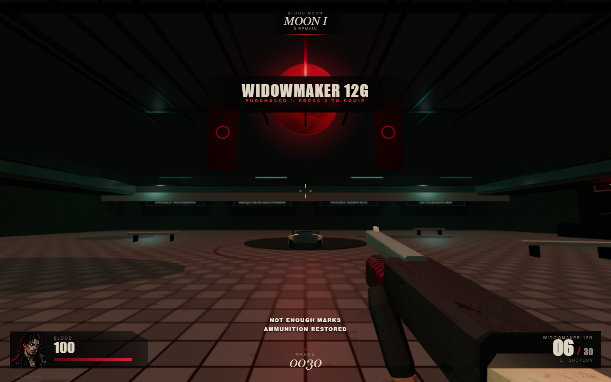
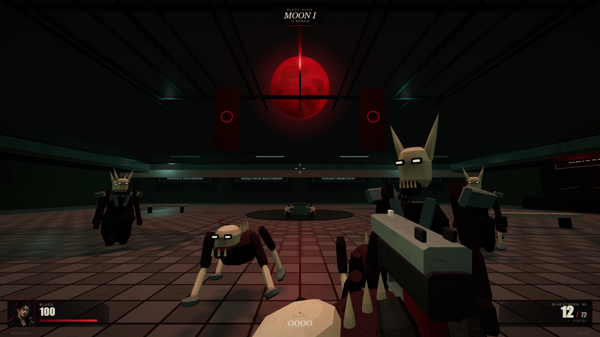
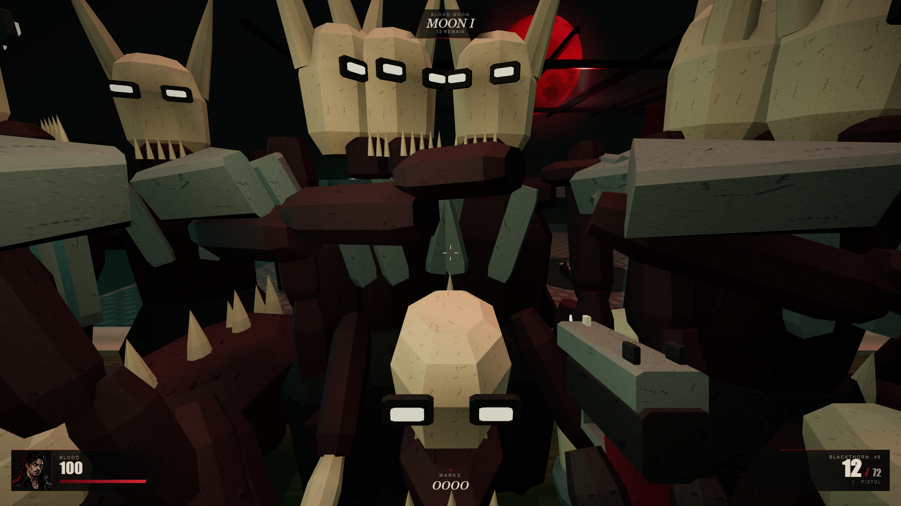
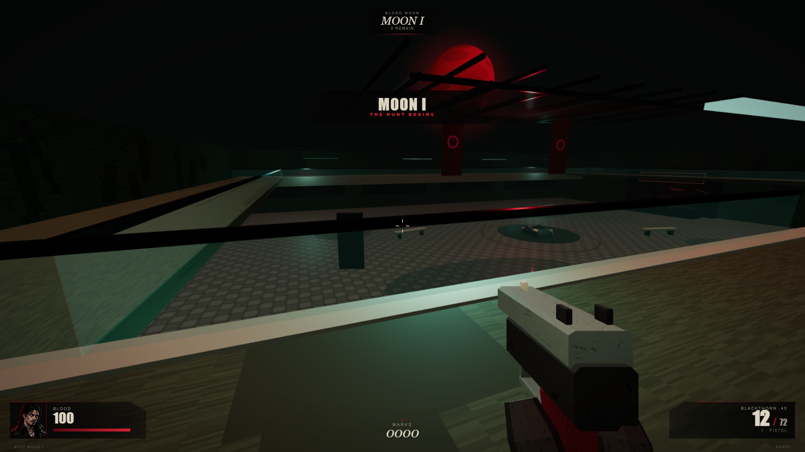
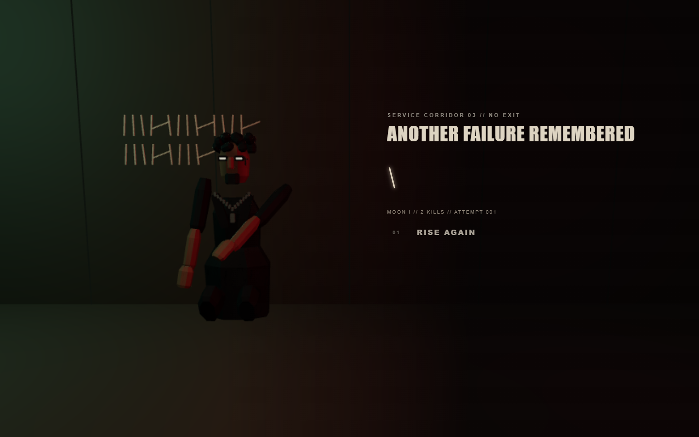

# Astra implementation review — 24 September 2026

## Finding

The previous V2 implementation was materially short of the supplied plan. Its ledger described several required V2 items as deferred, and the test suite primarily asserted source text instead of exercising behavior. The overhaul now has substantially stronger gameplay foundations and executable evidence. It is still a review build: the final art-production and human-playtest gates are not asserted complete.

## Defects corrected

- Simulation was tied to render frames. Combat and movement now use a bounded 120 Hz accumulator; visual effects and UI advance separately.
- Projectiles and knife attacks could pass through scenery. Analytic world obstruction now bounds firearm hits, melee and enemy attacks.
- Enemies could attack a player above them because distance was flattened. Attack volumes and line-of-sight now respect elevation.
- Reload/melee timers could advance while paused. They now freeze with the simulation; trigger and movement state clear on pause/blur.
- Air control could brake slide-jump momentum. Wish-direction acceleration preserves carried speed.
- Jumping on an upper floor would reset the player's feet near ground level. Jump now starts from the current surface.
- Escalators were decorative solid blockers and balconies had no collision/navigation surface. Two ramps now connect to a continuous walkable upper ring.
- One pillar initially intersected the new ramp. All-pillar route tests caught it and the authored/collision placements were corrected together.
- The first combat soak found side-entry stalls at both escalators. Navigation had accepted an edge that collision could not traverse. Tightening the wedge tolerance and waypoint following fixed the defect; both observed positions are permanent regression cases.
- Stalker “leaps” lasted only one frame. Pounces now have a tell and a sustained, collision-constrained movement window.
- Pounce landing now completes during stagger or a close-range attack, preventing an interrupted Stalker from hanging above the floor.
- Enemy death was immediate disappearance. Corpses now animate briefly and return to the pool.
- Existing save values were unversioned and could admit non-finite/fractional data. Migration preserves attempts/best Moon and sanitizes invalid values.
- Render quality mainly capped device pixel ratio, which did little at 1x displays. Quality now scales the actual render resolution and multiple effect budgets.
- The weapon blocked too much of the view; grain obscured scenery. Viewmodels were resized/replaced and the heavy grain was removed.

## New or rebuilt presentation

Thirteen editable model sources and compressed GLBs cover Blackthorn, Widowmaker, knife/hands, Thrall, Stalker, hunter, storefront, pillar, fountain, escalator, service door, railing and debris. The atlas, faceted topology and node animation are original project work. An offline cosine-weighted raycast pass bakes geometric ambient occlusion into vertex colors before mesh compression. First-person clips move the magazine, slide, pump and arms, supplemented by view sway, equip motion, recoil, muzzle light, smoke, ejected shells, pooled impact particles and hit feedback.

The title uses the live atrium with slow camera motion and keyboard navigation. Blood/portrait, Marks and ammunition remain on the required edges. Options now function. The death sequence slows enemies and collapses audio, fades red to black, then shows a modeled hunter against a physical tally wall with a new scratch and immediate restart.

The mall has traversable vertical routes, shutter textures, stone/plaster decay, inset storefront modules and signs, wet surfaces using a static reflection capture, and additional occult stains as Moons progress. The red moon is framed through the skylight while cyan lights distinguish the mall's edges.

## Verification

- **34 behavioral checks:** render-rate independence; bounded catch-up; movement chain; upper-floor jump; both ramp directions; every pillar; fountain; directory; shop; upper loop; both observed stuck locations; choke reservation; connected local recovery; damage; head/body and melee obstruction; once-per-swing hits; elevation; rewards; Moons I–V and 20-second intermissions; director relief; save migration/corruption/storage failure; Roman numerals.
- **13 GLB validations:** Khronos validator reports no errors; editable sources retain named clips.
- **Browser regression:** native pointer lock; >360-degree rotation; Escape and recapture; movement keys; knife windows/execution; headshot; paused reload; shop and ammo accounting; death/tally/restart; persistence; keyboard menu/options; denied-lock fallback. Uses an isolated browser profile.
- **Combat soak:** 13 live enemies traverse from the atrium to the upper floor; all must arrive. Damage is disabled only for this routing/performance scenario so it can complete.
- **Performance:** 1920×1080 headless Edge, device scale 1. High (native render scale, shadows, reflections) measured roughly 60 FPS average, 16.7 ms median, 16.9 ms p95 over 1,826 post-warmup samples. An earlier Balanced run measured roughly 60 FPS with 0.8 render scale. This is local evidence, not a guarantee for every work computer.
- TypeScript and a production Vite build are included in `pnpm test`. A validation-only GitHub workflow is included.
- The built production game was separately checked for asset loading, native pointer lock and Escape, zero page errors, and absence of development setup methods.
- In-app browser automation failed to initialize because its runtime imported a disallowed module. Browser checks therefore used Playwright with installed Edge.

Tests that arrange enemies, give test Marks, or trigger death are identified as scenario setups; they are not presented as an unassisted five-Moon human playthrough.

## Remaining gates and material limitations

1. **Blockbench round trip:** the web editor loaded, but automatic approval review twice denied opening the local model file there as an external transfer. An explicit authorization question remains pending. Local GLB validation is complete; browser-editor import/export is not claimed.
2. **Art acceptance:** articulated meshes and a reusable architectural GLB kit replace the previous primitives, with geometric vertex AO baked offline. Character animation uses rigid node articulation rather than skinned deformation. Floors, walls, skylight, glass, benches and banners are assembled in code. Final character likeness, animation polish and environmental composition still require visual acceptance against the reference brief.
3. **Reflection fidelity:** a static cubemap supplies wet reflections; enemies and the player are not dynamically reflected.
4. **Human evaluation:** repeated pacing, feel, visual identity and replayability comparison is still required. The plan's “award-winning” target cannot be certified from automated tests.
5. **Device certification and promotion:** other GPUs/work browsers still need testing. Pages remains unchanged until explicit comparison approval.

The new social preview is illustrative key art, not evidence of actual rendering. The screenshots below are actual browser captures.

## Screenshots

